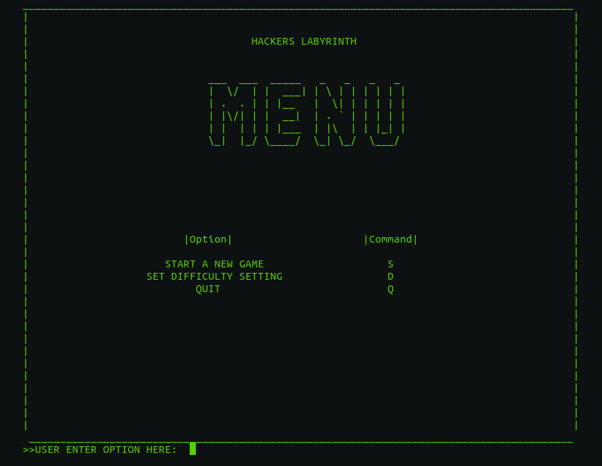

  <h1>Hacker-Labyrinth</h1>
  <h3>Group project for Software Engineering (CSCI 265) at VIU</h3>

 

  
  
 

   Our project will be a labyrinth type puzzle game where the player progresses through a series of computer science related challenges. The player will      have 3 attempts to complete each challenge, if successful the player will be rewarded with a clue that will help them escape. At the end of each    challenge the player will have a choice on what room they would like to go to next (left or right door) which will affect the forthcoming challenges. On   the final level of the game, the player will use the clues they have collected to complete the final challenge and escape the Hackers Labyrinth.

The story behind our game goes as follows:

  The player wakes up in a dark room. They look around and only see a terminal window open in the corner displaying the message “Welcome to my game,         complete my challenges and escape with your life, or face your doom!”. Challenge 1 begins.

 

  <h3>For more detailed documentation see the following links</h3>
  <ul>
    <li><a href="https://github.com/Enprogames/Hacker-Labyrinth/tree/main/documentation/Proposal.pdf" target="_blank">Project Proposal</a></li>
    <li><a href="https://github.com/Enprogames/Hacker-Labyrinth/tree/main/documentation/Team.pdf" target="_blank">Team Documentation </a></li>
    <li><a href="https://github.com/Enprogames/Hacker-Labyrinth/tree/main/documentation/RequirmentsDocument.pdf" target="_blank">Requirments Document</a></li>
    <li><a href="https://github.com/Enprogames/Hacker-Labyrinth/tree/main/documentation/DesignDocument.pdf" target="_blank">Design Document</a></li>
    <li><a href="https://github.com/Enprogames/Hacker-Labyrinth/tree/main/documentation/TestPlanning.pdf" target="_blank">Test Planning Document</a></li>
  </ul>

